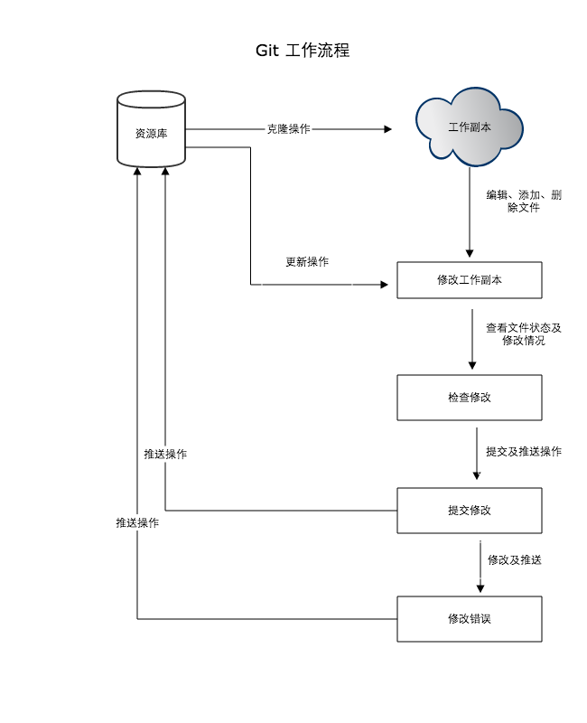

# Git使用

---

### 新建项目

1. 浏览器进入gitlab

		http://gitlab.yintech.net/
		
2. 登录或注册

3. 点击New project

	
	
4. 填写项目名称，项目描述和选择可视等级,然后点击Create Project

	
	
5. 复制项目地址，在git bash上执行
	
		git clone 项目地址

	
	
	\*注：在新建项目下方有一些常用的命令，可供参考
	
6. 至此，在执行命令的目录下会产生一个项目目录

### 基本操作

#### git init——初始化仓库

	要使用Git进行版本管理，必须先出实话仓库。Git是使用git init命名进行初始化的。如果出实话成功，执行了git init的命令目录下就会生成.git目录。这个目录里存储着管理当前内容所需的仓库数据。
		
#### git status——查看仓库的状态

	工作树和仓库在被操作的过程中，状态会不断发生变化。git status命令用于显示Git仓库的状态。
	
#### git add——向缓冲区中添加文件

	要想让文件成为Git仓库的管理对象，就需要用git add命令将其加入暂存区（Stage或者Index）中。暂存区市提交之前的一个临时区域。
	
#### git commit——保存仓库的历史记录

	git commit命令可以将当前暂存区中的文件保存到仓库的历史记录中。通过这些记录，我们就可以在工作树中复原文件。
	
#### git log——查看提交日志

	git log命令可以查看以往仓库中提交的日志。如果想查看提交所带来的改动，可以加上-p参数，文件的前后差别就会显示在提交信息之后。
	
#### git diff——查看更改前后的差别

	git diff命令可以查看工作树、暂存区、最新提交之间的差别。
	
#### git branch——显示分支一览表

	git branch命令可以将分支名列表显示，同时可以确认当前所在分支。
	
#### git checkout -b——创建、切换分支

	如果想以当前的master分支为基础创建新的分支，我们需要用到git checkout -b命令。
	git checkout master命令可以切换到主分支，git checkout -可以切换回上一分支。
	
#### git merge——合并分支

	首先切换到master分支，为了在历史记录中明确记录下本次分支合并，我们需要创建合并提交。因此，在合并时加上--no-ff参数。
	git merge --no-ff 需合并的分支名
	
#### git reset——回溯历史版本

	要让仓库的HEAD、暂存区、当前工作树回溯到指定状态，需要用到git reset --hard命令。
	
#### git push——推送至远程仓库
	
	如果想将当前分支下本地仓库中的内容推送至远程仓库，需要用到git push命令。
	
#### git clone——获取远程仓库

	执行git clone命令后我们会默认处于master分支下，同时系统会自动将origin设置成该远程仓库的标识符。
	
#### git pull——获取最新的远程仓库分支

	使用git pull命令，将本地的分支更新到最新状态。
	如果两人同时修改同一部分的源代码，push时就很容易发生冲突。所以多名开发者在同一分支进行作业时，为减少冲突情况的发生，建议更频繁地进行push和pull操作。

### Git 工作流程

一般工作流程如下：

1. 克隆 Git 资源作为工作目录。
2. 在克隆的资源上添加或修改文件。
3. 如果其他人修改了，你可以更新资源。
4. 在提交前查看修改。
5. 提交修改。
6. 在修改完成后，如果发现错误，可以撤回提交并再次修改并提交。

下图展示了 Git 的工作流程：

### Git 工作区、暂存区和版本库

* __工作区__: 就是你在电脑里能看到的目录。
* __暂存区__: 英文叫stage, 或index。一般存放在 ".git目录下" 下的index文件（.git/index）中，所以我们把暂存区有时也叫作索引（index）。
* __版本库__: 工作区有一个隐藏目录.git，这个不算工作区，而是Git的版本库。

图中左侧为工作区，右侧为版本库。在版本库中标记为 "index" 的区域是暂存区（stage, index），标记为 "master" 的是 master 分支所代表的目录树。

图中我们可以看出此时 "HEAD" 实际是指向 master 分支的一个"游标"。所以图示的命令中出现 HEAD 的地方可以用 master 来替换。

图中的 objects 标识的区域为 Git 的对象库，实际位于 ".git/objects" 目录下，里面包含了创建的各种对象及内容。

当对工作区修改（或新增）的文件执行 "git add" 命令时，暂存区的目录树被更新，同时工作区修改（或新增）的文件内容被写入到对象库中的一个新的对象中，而该对象的ID被记录在暂存区的文件索引中。

当执行提交操作（git commit）时，暂存区的目录树写到版本库（对象库）中，master 分支会做相应的更新。即 master 指向的目录树就是提交时暂存区的目录树。

当执行 "git reset HEAD" 命令时，暂存区的目录树会被重写，被 master 分支指向的目录树所替换，但是工作区不受影响。

当执行 "git rm --cached <file>" 命令时，会直接从暂存区删除文件，工作区则不做出改变。

当执行 "git checkout ." 或者 "git checkout -- <file>" 命令时，会用暂存区全部或指定的文件替换工作区的文件。这个操作很危险，会清除工作区中未添加到暂存区的改动。

当执行 "git checkout HEAD ." 或者 "git checkout HEAD <file>" 命令时，会用 HEAD 指向的 master 分支中的全部或者部分文件替换暂存区和以及工作区中的文件。这个命令也是极具危险性的，因为不但会清除工作区中未提交的改动，也会清除暂存区中未提交的改动。