# 在windows下安装git

---

### 下载git Windows客户端

		下载地址：https://git-scm.com/downloads
		
### Git客户端安装

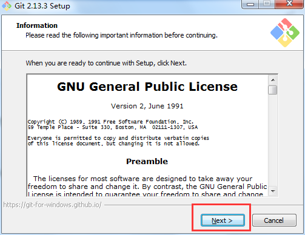
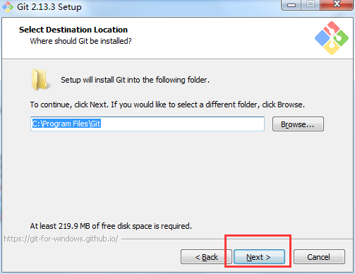
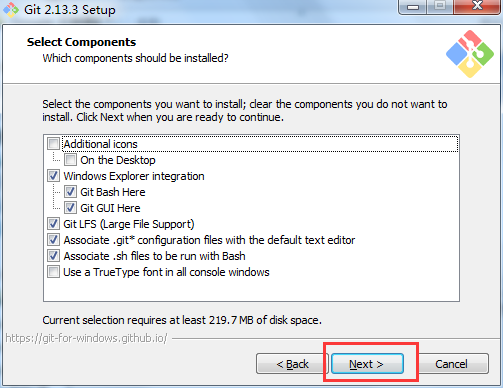
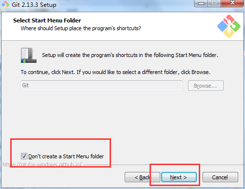
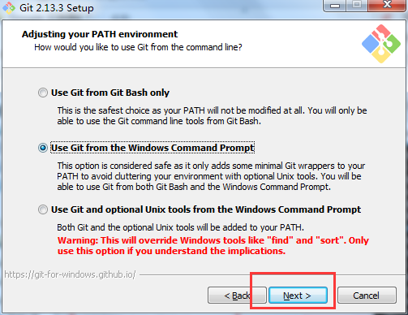
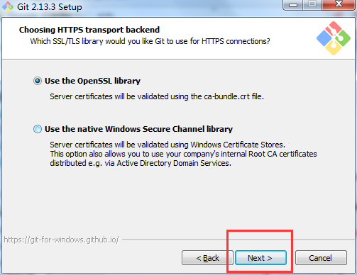
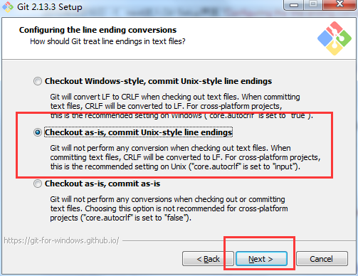
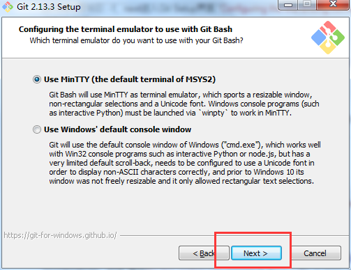
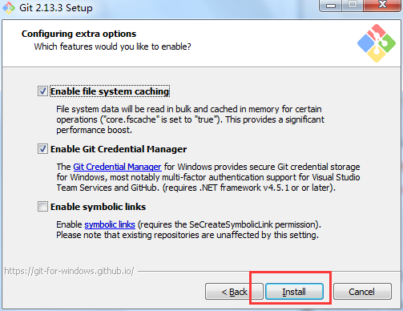
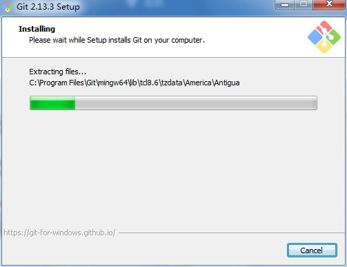
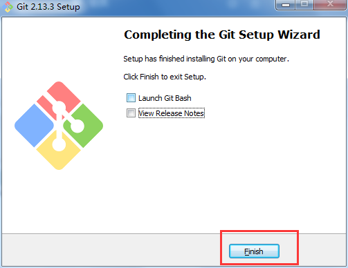

### 生成ssh key
	
1. 在~/.ssh目录下右键打开Git Bash Here

2. 替换邮箱并执行命令

		ssh-keygen -t rsa -C "yourmail@yintech.cn"

3. 输入生成文件名：

		id_rsa_gitlab

4. 然后会要求输入口令passphrase，可以直接回车不输入

5. 确认passphrase或直接回车

6. 在~/.ssh目录下可以看见有两个文件：id_rsa_gitlab（私钥）和id_rsa_gitlab.pub（公钥）

### 配置ssh key

1. 在git bash上执行

		ssh-agent
		
2. 然后执行命令
		
		ssh-add ~/.ssh/id_rsa_gitlab
		
\* 如果出现错误
		
	Could not open a connetion to your authenication agent.
	
1. 输入如下命令查看已开启的ssh-agent线程

		ps aux | grep ssh

2. 执行命令杀死进程

		kill -9 进程号
	
3. 再执行一下命令

		exec ssh-agent bash
		eval ssh-agent -s
		ssh-add ./id_rsa_gitlab
	
4. 在~/.ssh目录下创建并编辑config文件

		vim config
		
	编辑以下内容并保存文件

		# gitlab
		Host *
		HostName gitlab.yintech.net
		PreferredAuthentications publickey
		AddKeysToAgent yes
		IdentityFile ~/.ssh/id_rsa_gitlab
		User YourName

		
### 配置git
1. 配置git全局用户名和邮箱，执行一下命令
	
		git config --global user.name "your name"
		git config --global user.email "your email"

2. 浏览器进入

		http://gitlab.yintech.net/

3. 登录或注册

4. 点击用户配置

	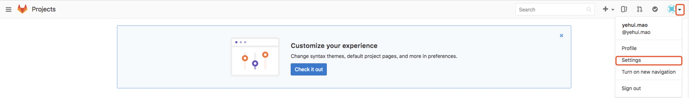

5. 复制~/.ssh/id\_rsa\_gitlab.pub公钥的内容到Key，然后添加公钥

	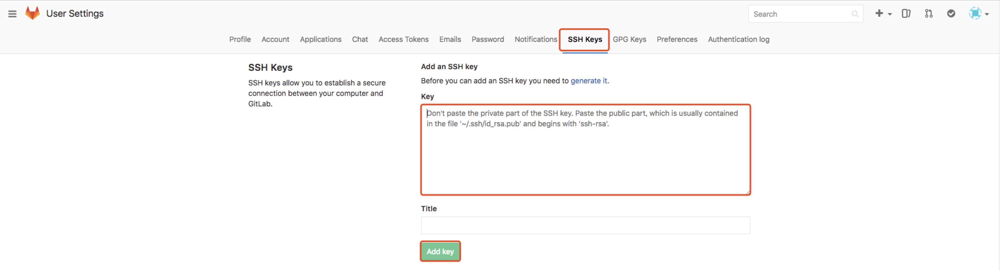

---

\* 注：TortoiseGit是一个开放的，为的git版本控制系统的源客户端。我们可以安装TortoiseGit用来简化Git操作和仓库管理。

	下载地址：https://tortoisegit.org/download/