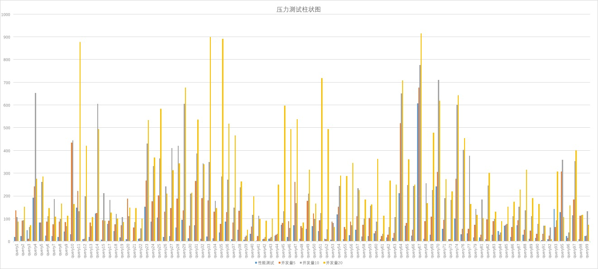
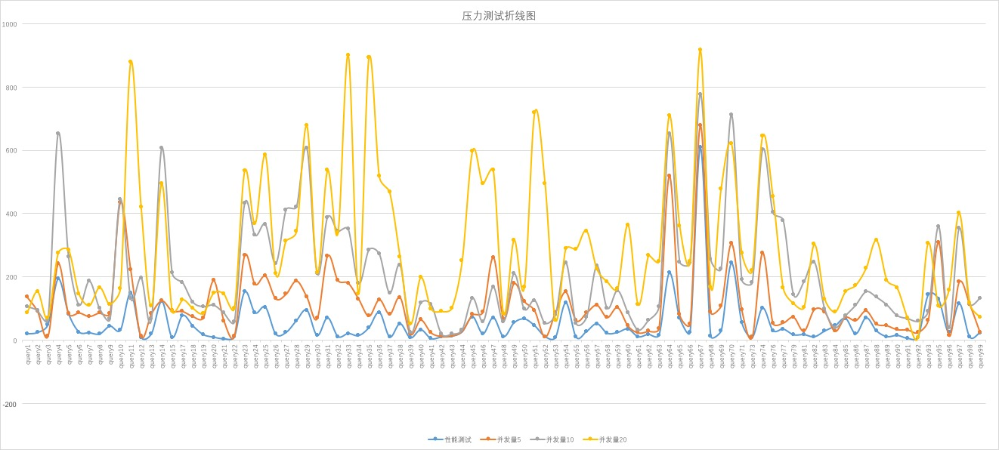
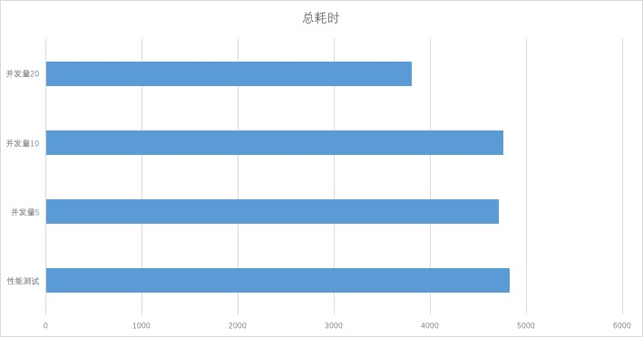

# LLAP压力测试报告

之前，通过测试对比MapReduce、Tez和LLAP在Hive上的执行效率，我们发现在资源条件都一致的情况下，LLAP在Hive的执行效率最高，查询耗时最短。因此，我们认为LLAP更适用于交互式查询的场景，并决定使用LLAP+Tez的方式来查询Hive。

### 高并发对LLAP的影响

现在，我们将要来测试高并发对LLAP查询性能的影响。下面以TPC-DS产生500G数据为测试基准，测试并发量为1、5、10和20时的LLAP的查询消耗时间。

___柱状图___

可以从柱状图中看出，对于大多数查询而言，查询耗时随着并发量的提高而增加。在并发度为1时，集群将资源尽最大可能分配给单个任务，但不是全部资源，这是根据数据量的大小和数据块数决定的。而在并发度足够大时，集群资源不足，此时请求的任务，需要排队等待资源释放。待资源释放后，才能继续执行。所以在高并发的情形下，单个查询的耗时会增加。

___折线图___

从折线图中，我们发现并发度为1的查询耗时是最少的，并发度为20的查询耗时是最大的。随着并发量的增加，单个查询任务的耗时也成倍增长。

___总耗时___

从上图可以看出并发量越高，总耗时越小，即集群资源的利用率越高。在高并发的情况下，集群资源始终处于高利用状态，发挥了集群的最大性能。

