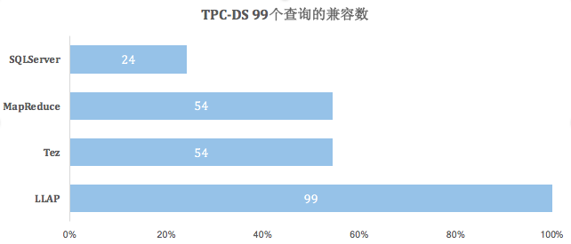
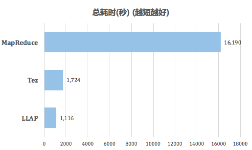
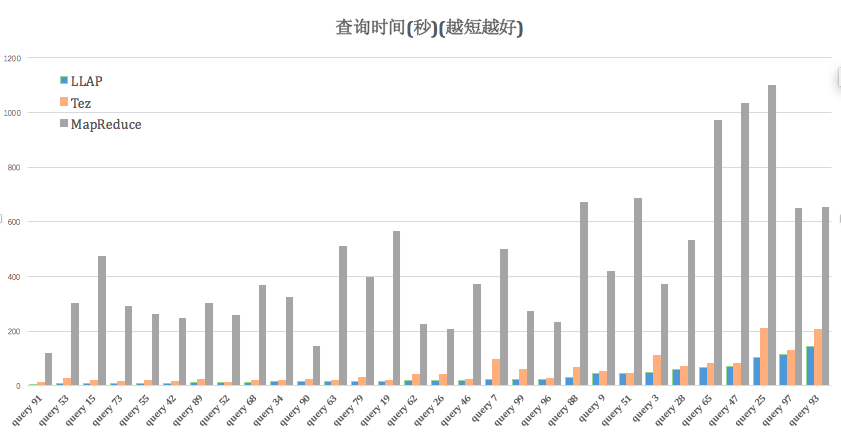
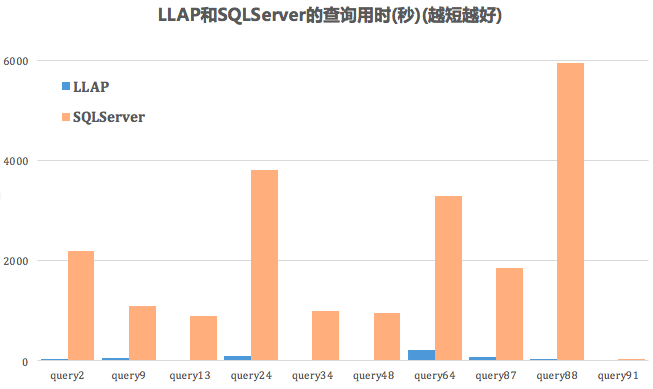

#### Hive引擎性能测试报告

我们当前使用的大数据平台是Hortonworks的HDP 2.6，其最令人兴奋的新功能之一是支持对Apache Hive使用LLAP进行查询。

我们使用TPC-DS产生500G数据为测试基准，使用了99个TPC-DS查询，对不同执行引擎和传统数据库进行了测试。结果展示，基于__LLAP+Tez的引擎比Tez平均节省33%的时间，比MapReduce执行引擎快20倍以上，比传统关系型数据库SQLServer快60倍__。

##### LLAP的兼容性最优

#####  LLAP+Tez  vs  Tez  vs  MapReduce

MapReduce执行效率慢的原因在于，其每个任务都将中间结果存储到HDFS上，即前一个步骤中的reducer为下一个步骤中的mapper提供数据。所以在使用MapReduce的时候，存在大量的磁盘IO，大大降低了执行效率。

而Tez仅在一个任务中就能完成同样的处理过程，任务之间不需要访问HDFS，这会缩减由于磁盘读写造成的耗时。LLAP在Tez的基础上，包含一个长久存活的守护程序去代替了和HDFS datanode的直接交互和一个紧密集成的DAG框架。这个守护程序中加入了缓存、预抓取、查询过程和访问控制等功能，短小的查询由守护程序执行，大的重的操作由yarn的container执行，进一步加快了查询效率。

31个TPC-DS的查询的具体性能对比如下：

在数据量剧增和复杂SQL的情况下，三种引擎的耗时趋势也大致相同。相对来说，LLAP+Tez和Tez的波动较小，而MapReduce由于磁盘读写等物理因素的影响对耗时的波动较大。

#####  vs 传统数据库（SQLServer）

我们对SQL Server单机节点做了同样的500G数据的TPC-DS测试，在完全不更改查询语句的情况下，SQL Server仅兼容11个查询，其主要原因是SQL Server不支持"limit"语法。11个兼容的查询测试结果如下：

LLAP+Tez比SQL Server平均查询性能快61倍，在复杂的查询（如Query 88）上，LLAP可以比SQL Server快200倍。

#####  测试时硬件配置

__HDP集群配置__

5个LLAP工作节点，共有：

* 224G 内存
* 42个vcores
* 42个执行器

__SQL Server节点配置__

* 一台服务器
* 256GB内存